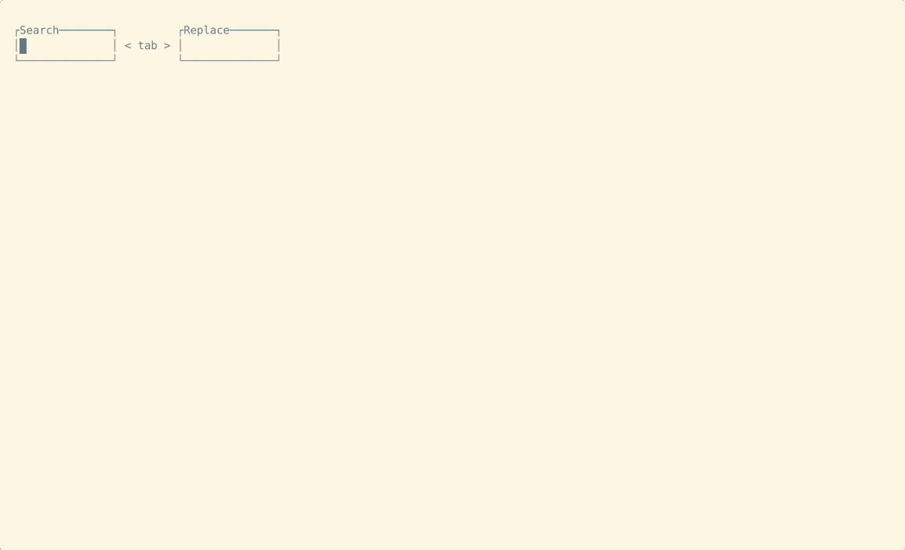

# Live Action Search and Replace (LASR)

When performing a global search-and-replace using e.g. `sed`, it can be difficult to hone in on the exact correct pattern.
`lasr` makes this easier by showing live results as you type.



# Installation

Binary artifacts can be downloaded from the [releases page](https://github.com/rcorre/lasr/releases).

If you have a rust toolchain, you can install from source:

```bash
cargo install lasr
```

# Usage

Simply run `lasr` to start a search-and-replace in the current directory. You may run `lasr <path>` to search a different directory.
This will open a TUI where you can start typing a search pattern and see live matches below.
Once you are happy with the search pattern, press <kbd>Tab</kbd> to start editing the replacement pattern.
Finally,

# Syntax

The pattern syntax is based on the rust [regex](https://docs.rs/regex/latest/regex/#syntax) crate.
The replacement syntax is based on the [replace](https://docs.rs/regex/latest/regex/struct.Regex.html#method.replace) method in that crate.

Replacements may reference numbered groups as `$1` or `${1}`, or named groups like `$foo` or `${foo}`. The `{}` brackets may be necessary to separate the replacement from other text. `$0` or `${0}` refers to the entire match.

# Configuration

The configuration file is located at `$XDG_CONFIG_HOME/lasr/lasr.toml` (`~/.config/lasr/lasr.toml` by default).
The current configuration can be printed by running `lasr --dump-config`. This can be used as a starting point to edit your own configuration:

```bash
lasr --dump-config > ~/.config/lasr/lasr.toml
```

Here's an example config with default values:

```toml
[theme.base]
fg = "Reset"

[theme.find]
fg = "Red"
add_modifier = "CROSSED_OUT"

[theme.replace]
fg = "Green"
add_modifier = "BOLD"

[keys]
enter = "confirm"
esc = "exit"
c-c = "exit"
tab = "toggle_search_replace"
```

## Theme

The `theme` section of the config includes 3 "style" sub-sections:

| key       | description                 |
| --------- | --------------------------- |
| `base`    | Most text/UI                |
| `find`    | Text matched by the pattern |
| `replace` | Replacement text            |

A "style" has the following attributes

| key            | description                 |
| -------------- | --------------------------- |
| `fg`           | Foreground color            |
| `bg`           | Background color            |
| `add_modifier` | Add modifiers               |
| `sub_modifier` | Remove modifiers            |

A color can be an [ANSI color name] like `"red"`, an [ANSI 8-bit color index] like `"7"`, or a hex string like `"#00FF00"`.

[ANSI color name]: https://docs.rs/ratatui/latest/ratatui/style/enum.Color.html
[ANSI 8-bit color index]: https://en.wikipedia.org/wiki/ANSI_escape_code#8-bit

`add_modifier` and `sub_modifier` can be one of the following:

- `"BOLD"`
- `"DIM"`
- `"ITALIC"`
- `"UNDERLINED"`
- `"SLOW_BLINK"`
- `"RAPID_BLINK"`
- `"REVERSED"`
- `"HIDDEN"`
- `"CROSSED_OUT"`

## Keys

The `keys` section specifies key bindings. Each key is a single character or key name, optionally followed by "c-" and/or "a-" to specify a ctrl or alt modifier. The following are valid key names:

- <kbd>a</kbd>-<kbd>z</kbd>, <kbd>0</kbd>-<kbd>9</kbd>
- <kbd>f0</kbd>-<kbd>f12</kbd>
- <kbd>backspace</kbd>
- <kbd>enter</kbd>
- <kbd>left</kbd>
- <kbd>right</kbd>
- <kbd>up</kbd>
- <kbd>down</kbd>
- <kbd>home</kbd>
- <kbd>end</kbd>
- <kbd>pageup</kbd>
- <kbd>pagedown</kbd>
- <kbd>tab</kbd>
- <kbd>backtab</kbd>
- <kbd>delete</kbd>
- <kbd>insert</kbd>
- <kbd>esc</kbd>

Each value in the `keys` section is one of the following actions:

- `noop`: Do nothing, used to unbind a default key
- `exit`: Exit without performing any replacement
- `confirm`: Exit and perform replacements
- `toggle_search_replace`: Switch focus between the "search" and "replace" inputs
- `cursor_left`: Move cursor left one character
- `cursor_right`: Move cursor right one character
- `cursor_home`: Move cursor to beginning of line
- `cursor_end`: Move cursor to end of line
- `delete_char`: Delete character at cursor position
- `delete_char_backward`: Delete character before cursor (backspace)
- `delete_word`: Delete word before cursor
- `delete_to_end_of_line`: Delete from cursor to end of line
- `delete_line`: Delete entire line

## Default Key Bindings

The following readline-emacs-style key bindings are available by default:

| Key                                      | Action                  |
|------------------------------------------|-------------------------|
| <kbd>Enter</kbd>                         | `confirm`               |
| <kbd>Esc</kbd>                           | `exit`                  |
| <kbd>Ctrl+C</kbd>                        | `exit`                  |
| <kbd>Tab</kbd>                           | `toggle_search_replace` |
| <kbd>←</kbd> / <kbd>Ctrl+B</kbd>         | `cursor_left`           |
| <kbd>→</kbd> / <kbd>Ctrl+F</kbd>         | `cursor_right`          |
| <kbd>Home</kbd> / <kbd>Ctrl+A</kbd>      | `cursor_home`           |
| <kbd>End</kbd> / <kbd>Ctrl+E</kbd>       | `cursor_end`            |
| <kbd>Backspace</kbd> / <kbd>Ctrl+H</kbd> | `delete_char_backward`  |
| <kbd>Ctrl+D</kbd>                        | `delete_char`           |
| <kbd>Ctrl+W</kbd>                        | `delete_word`           |
| <kbd>Ctrl+K</kbd>                        | `delete_to_end_of_line` |
| <kbd>Ctrl+U</kbd>                        | `delete_line`           |

# Other cool search/replace tools

- [sad](https://github.com/ms-jpq/sad) allows you to approve/reject each replacement, but must be re-run each time you change the pattern.
- [sd](https://github.com/chmln/sd) provides a simpler CLI alternative to `sed`, but is not interactive.
- [ast-grep](https://github.com/ast-grep/ast-grep) is like `sed`/`grep`, but using tree-sitter to match code syntax.
